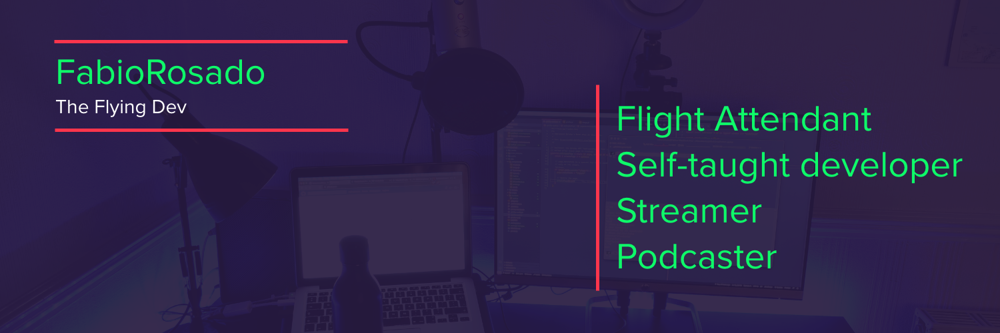

# Hello I'm FabioRosado 👋

## I'm a flight attendant by day and self-taught developer by night.

Building projects live on  [Twitch](https://twitch.tv/theflyingdev) |  contributing to open source | Talking with devs about their journey on [Landing In Tech](https://landingintech.com) podcast.

 

## &#x270d; Blog & Writing

- Write about things that I have learned at [FabioRosado.dev](https://fabiorosado.dev)
- Cultivating a digital garden at [TheFlying.Dev](https://theflying.dev)

## 🔧 Technologies & Tools

  

 
 
 
  
 

## &#x1f4c8; GitHub Stats

